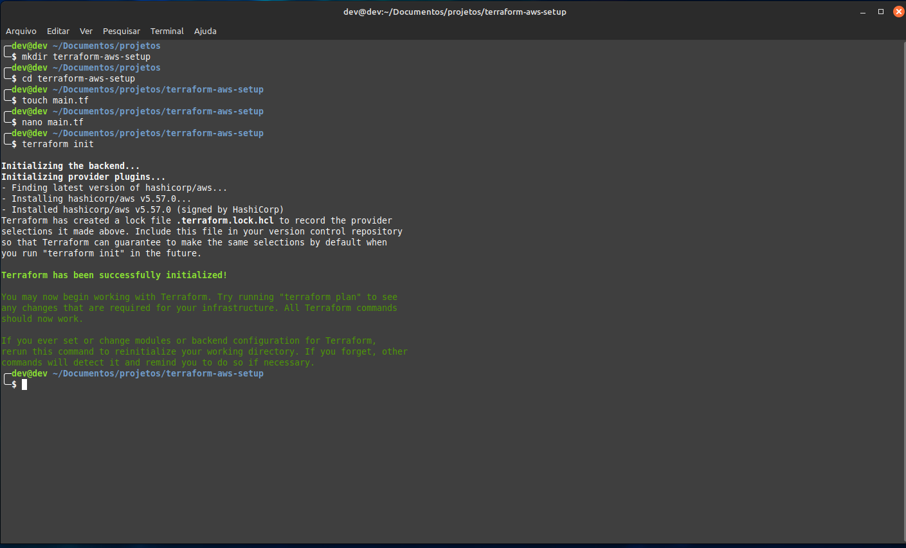
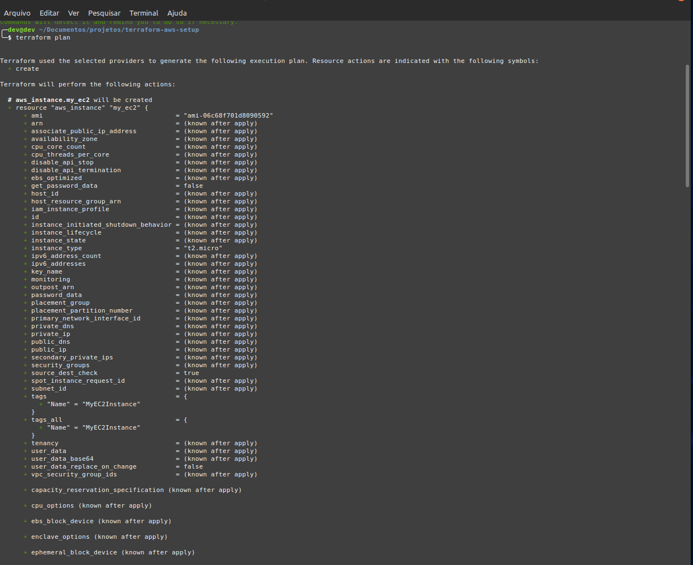
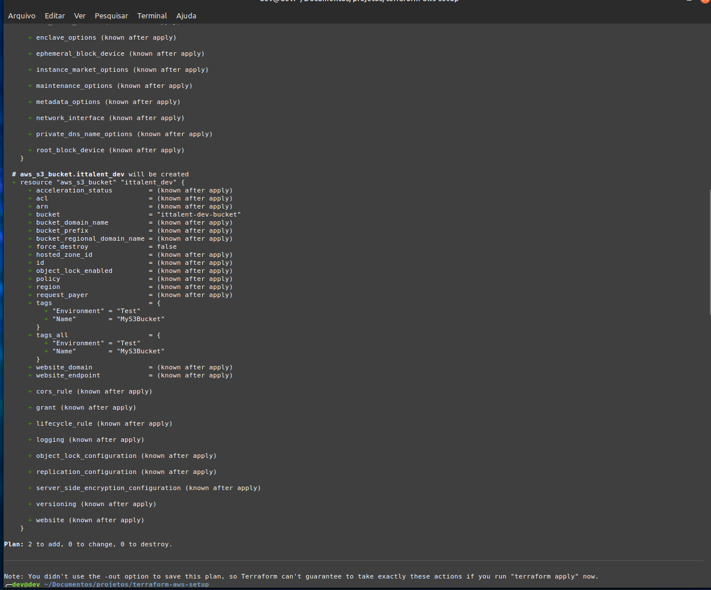
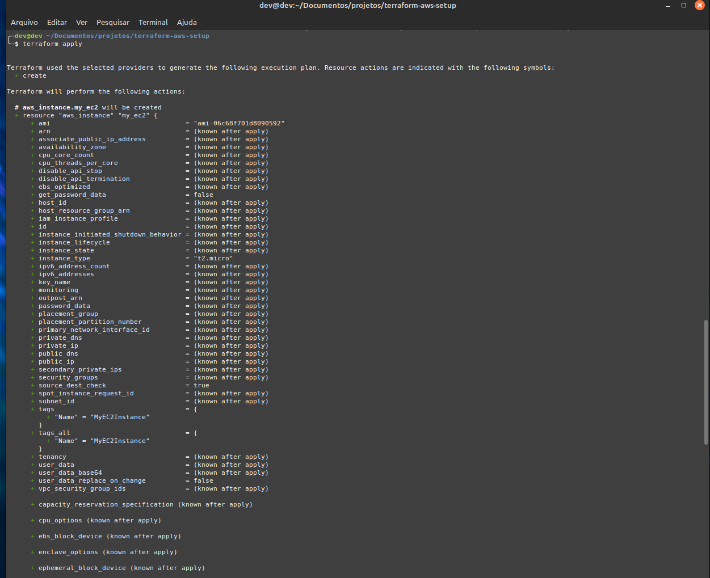
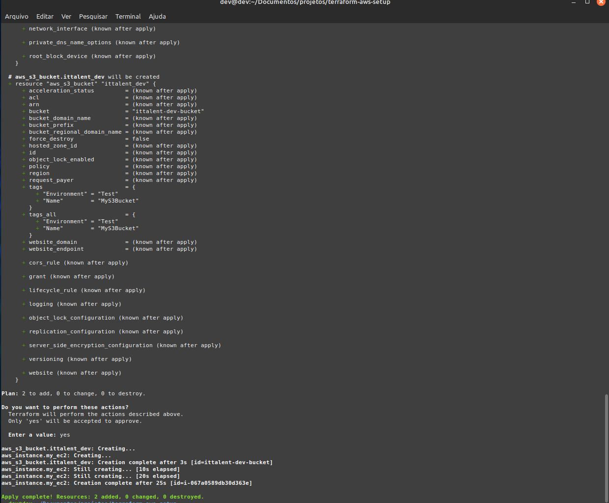
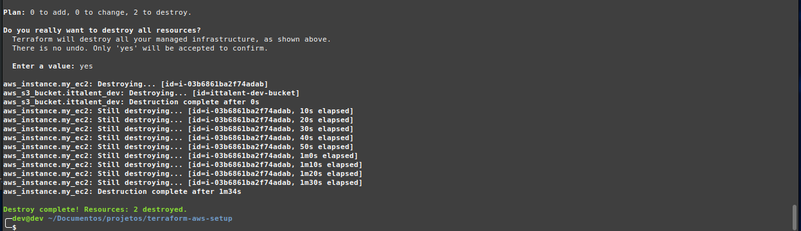
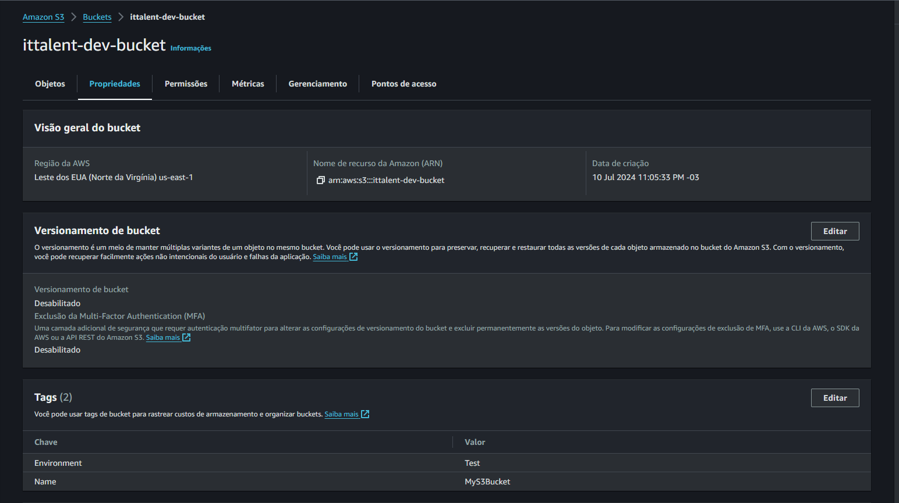
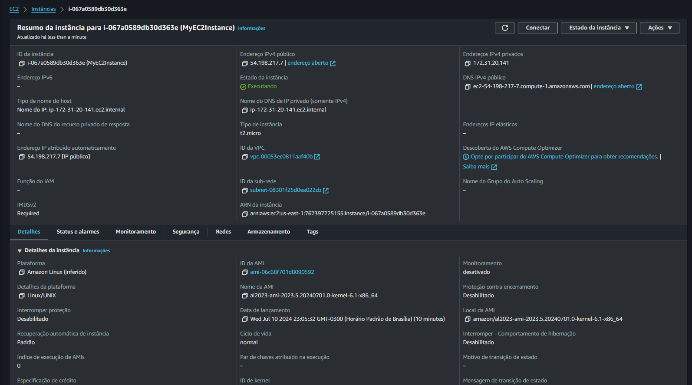

# Documentação do Projeto Terraform

Este documento apresenta uma visão detalhada das etapas de execução do Terraform para provisionamento de recursos na AWS, incluindo uma instância EC2 e um bucket S3.

## Terraform

### Inicialização do Terraform

Aqui é mostrada a inicialização do Terraform, que prepara o ambiente para os próximos comandos.

### Plano de Execução do Terraform

Os próximos dois screenshots mostram o plano de execução, detalhando as ações que o Terraform pretende realizar.

### Aplicação do Plano

Estas imagens documentam a aplicação do plano, onde o Terraform efetivamente cria os recursos especificados.

### Destruição dos Recursos

Esta captura de tela mostra o comando de destruição, utilizado para remover os recursos previamente criados.

## AWS

### Verificação no Console da AWS

#### Bucket S3

A imagem abaixo mostra o bucket S3 conforme visualizado no console da AWS.

#### EC2

Aqui está a captura de tela da instância EC2 criada, também visualizada através do console da AWS.

## Conclusão

As capturas de tela acima documentam todo o processo de uso do Terraform para provisionar e gerenciar recursos na AWS. Essas imagens servem como uma referência visual para validar cada etapa executada no projeto.
